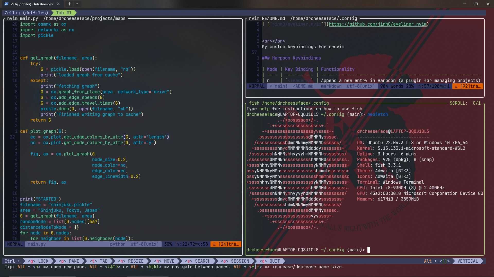

# My Neovim, Tmux and Zellij configs!


# 🦟 BUGS! 🐛
 - ✅ packer needs a :so command everytime you want to run packer commands
# 

<br></br>
## Vim
### Installation guide
install c compiler if you dont already have one
```
apt install gcc -y
```
copying neovim config folder to ~/.config
```
git clone https://github.com/DrCheeseFace/dotfiles.git ~/.config
nvim
```
make sure neovim is v0.8+
If Packer does not automatically start installing plugins V
```
 cd ~/.config/nvim/lua/drcheeseface
 nvim packer.lua
 //type the vim commands
 :so
 :PackerCompile
 :PackerSync
```
for grep functionality install ripgrep (you want this)
```
sudo apt install ripgrep -y
```
After a relaunch, the transparent backgroud should be working

### Plugins
The plugins I use in my neovim config
<details>
<summary>(Theres alota them)</summary>
<br>

| Plugin                                                                                  | Description                                 |
| --------------------------------------------------------------------------------------- | ------------------------------------------- |
| [`rose-pine/neovim`](https://github.com/rose-pine/neovim)                               | Rose Pine colorscheme                       |
| [`wbthomason/packer.nvim`](https://github.com/wbthomason/packer.nvim)                   | Plugin manager                              |
| [`nvim-telescope/telescope.nvim`](https://github.com/nvim-telescope/telescope.nvim)     | Fuzzy finder                                |
| [`nvim-treesitter/nvim-treesitter`](https://github.com/nvim-treesitter/nvim-treesitter) | Syntax tree sitter                          |
| [`nvim-lua/plenary.nvim`](https://github.com/nvim-lua/plenary.nvim)                     | Plenary library (required for some plugins) |
| [`ThePrimeagen/harpoon`](https://github.com/ThePrimeagen/harpoon)                       | Project navigation                          |
| [`mbbill/undotree`](https://github.com/mbbill/undotree)                                 | Visualize undo history in a tree format     |
| [`tpope/vim-fugitive`](https://github.com/tpope/vim-fugitive)                           | Git integration                             |
| [`williamboman/mason.nvim`](https://github.com/williamboman/mason.nvim)                 | Portable package manager                    |
| [`windwp/nvim-autopairs`](https://github.com/windwp/nvim-autopairs)                     | Autopairs                                   |
| [`numToStr/Comment.nvim`](https://github.com/numToStr/Comment.nvim)                     | Commenting plugin                           |
| [`vim-airline/vim-airline`](https://github.com/vim-airline/vim-airline)                 | Statusline                                  |
| [`vim-airline/vim-airline-themes`](https://github.com/vim-airline/vim-airline-themes)   | Themes for vim-airline                      |
| [`L3MON4D3/LuaSnip`](https://github.com/L3MON4D3/LuaSnip)                               | Snippet engine for Neovim in Lua            |
| [`saadparwaiz1/cmp_luasnip`](https://github.com/saadparwaiz1/cmp_luasnip)               | LuaSnip source for nvim-cmp                 |
| [`hrsh7th/cmp-nvim-lsp`](https://github.com/hrsh7th/cmp-nvim-lsp)                       | LSP source for nvim-cmp                     |
| [`rafamadriz/friendly-snippets`](https://github.com/rafamadriz/friendly-snippets)       | Collection of pre-configured snippets       |
| [`neovim/nvim-lspconfig`](https://github.com/neovim/nvim-lspconfig)                     | Configuration for built-in LSP              |
| [`hrsh7th/nvim-cmp`](https://github.com/hrsh7th/nvim-cmp)                               | Autocompletion plugin                       |
| [`iamcco/markdown-preview.nvim`](https://github.com/iamcco/markdown-preview.nvim)       | Markdown previewer                          |
| [`pineapplegiant/spaceduck`](https://github.com/pineapplegiant/spaceduck)               | Nice theme                                  |
| [`jinh0/eyeliner.nvim`](https://github.com/jinh0/eyeliner.nvim)                         | Easier horizontal movement                  |
| [`echasnovski/mini.indentscope`](https://github.com/echasnovski/mini.indentscope)       | Indentation indicator highlightors          |
| [`folke/noice.nvim`](https://github.com/folke/noice.nvim)                               | pretty vim commands                         |
| [`rcarriga/nvim-notify`](https://github.com/rcarriga/nvim-notify)                       | Notifs                                      |
| [`MuniTanjim/nui.nvim`](https://github.com/MunifTanjim/nui.nvim)                        | Dependency for noice.nvim                   |
| [`echasnovski/mini.surround`](https://github.com/echasnovski/mini.surround)             | surrounding text shortcuts                  |
</details>

<br></br>
My custom keybindings for neovim

### Harpoon Keybindings

| Mode | Key Binding | Functionality                                                  |
| ---- | ----------- | -------------------------------------------------------------- |
| n    | `<leader>a` | Append a new entry in Harpoon (a plugin for managing projects) |
| n    | `<C-e>`     | Toggle the quick menu in Harpoon for project navigation        |
| n    | `<C-h>`     | Select the first entry in Harpoon's project list               |
| n    | `<C-t>`     | Select the second entry in Harpoon's project list              |
| n    | `<C-n>`     | Select the third entry in Harpoon's project list               |
| n    | `<C-s>`     | Select the fourth entry in Harpoon's project list              |

### General Vim Commands

| Mode | Key Binding  | Functionality                                                 |
| ---- | ------------ | ------------------------------------------------------------- |
| n    | `<leader>pv` | Execute `vim.cmd.Ex` (show integrated neovim navigation       |
| n    | `<C-d>`      | Scroll half a screen down and reposition cursor to the center |
| n    | `<C-u>`      | Scroll half a screen up and reposition cursor to the center   |
| v    | `J`          | Move selected lines down                                      |
| v    | `K`          | Move selected lines up                                        |
| n    | `sa`         | add surrounding character                                     |
| n    | `sd`         | delete surrounding character                                  |
| n    | `sr`         | replace surrounding character                                 |
| n    | `<leader>cn` | clear notifs                                                  |

### Git Keybindings

| Mode | Key Binding  | Functionality              |
| ---- | ------------ | -------------------------- |
| n    | `<leader>gs` | Run the Git command in Vim |

### Fuzzy Finder Keybindings
| Mode | Key Binding  | Functionality                                            |
| ---- | ------------ | -------------------------------------------------------- |
| n    | `<leader>pf` | Open a fuzzy finder for files in the project             |
| n    | `<C-p>`      | Open a fuzzy finder for Git-tracked files in the project |
| n    | `<leader>ps` | Grep for a string in the project (user-inputted string)  |

### LSP Keybindings 

| Mode | Key Binding      | Function Description                            |
|------|------------------|-------------------------------------------------|
|  n   | `gd`             | Go to definition                                |
|  n   | `K`              | Show hover information                          |
|  n   | `<leader>vws`    | Workspace symbol search                         |
|  n   | `<leader>vd`     | Open diagnostic float window                    |
|  n   | `[d`             | Go to next diagnostic                           |
|  n   | `]d`             | Go to previous diagnostic                       |
|  n   | `<leader>vca`    | Show code actions                               |
|  n   | `<leader>vrr`    | List references for symbol                      |
|  n   | `<leader>vrn`    | Rename symbol                                   |
|  n   | `<C-h>`          | Show signature help in insert mode              |
|  n   | `<C-up>`         | Navigate to previous completion item            |
|  n   | `<C-down>`       | Navigate to next completion item                |
|  n   | `<C-y>`          | Confirm and select completion suggestion        |
|  n   | `<C-Space>`      | Trigger autocompletion                          |


<br></br>

## Zellij

This is a customized Zellij configuration with themes and UI modifications.

- [Tokyo Night Dark theme](https://github.com/zellij-org/zellij/blob/main/zellij-utils/assets/themes/tokyo-night-dark.kdl)
- rounded pane corners

### [Tokyo Night Dark](https://github.com/zellij-org/zellij/blob/main/zellij-utils/assets/themes/tokyo-night-dark.kdl)

```plaintext
themes{
  tokyo-night-dark {
          fg 169 177 214
              bg 26 27 38
              black 56 62 90
              red 249 51 87
              green 158 206 106
              yellow 224 175 104
              blue 122 162 247
              magenta 187 154 247
              cyan 42 195 222
              white 192 202 245
              orange 255 158 100
      }
  }
}
ui {
    pane_frames {
        rounded_corners true
    }
}

theme "tokyo-night-dark"

```

# TMUX Configuration

This is a customized TMUX configuration for a productive and aesthetically pleasing terminal experience.

## Configuration Settings

| Setting                                   | Description                                 |
| ----------------------------------------- | ------------------------------------------- |
| `setw -g mouse on`                        | Enable mouse support within TMUX            |
| `set -s default-terminal 'tmux-256color'` | Set the default terminal to 'tmux-256color' |

## Plugins

The configuration includes several plugins managed by [Tmux Plugin Manager (TPM)](https://github.com/tmux-plugins/tpm). The listed plugins are:
## TPM Installation

[Tmux Plugin Manager (TPM)](https://github.com/tmux-plugins/tpm) is used as the plugin manager for tmux


| Plugin                                                                        | Description                      |
| ----------------------------------------------------------------------------- | -------------------------------- |
| [`tmux-plugins/tpm`](https://github.com/tmux-plugins/tpm)                     | Tmux Plugin Manager              |
| [`tmux-plugins/tmux-sensible`](https://github.com/tmux-plugins/tmux-sensible) | Sensible configurations for TMUX |
| [`dracula/tmux`](https://github.com/dracula/tmux)                             | Dracula theme for TMUX           |

## Dracula Theme Customizations

The Dracula theme is customized with additional features. The following configurations are applied:

| Dracula Setting            | Value                  |
| -------------------------- | ---------------------- |
| `@dracula-plugins`         | "battery weather time" |
| `@dracula-show-powerline`  | true                   |
| `@dracula-show-fahrenheit` | false                  |
| `@dracula-military-time`   | true                   |


## TMUX example


