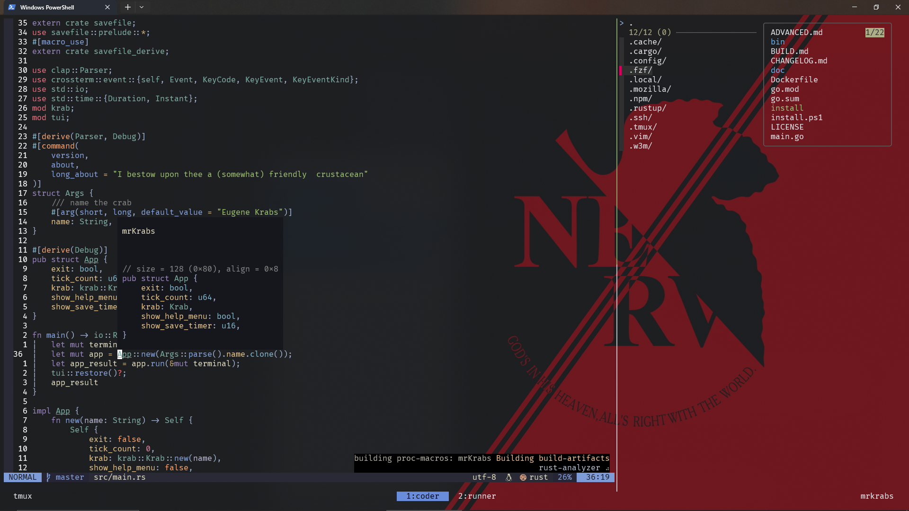

<h1 align="center">My Neovim, Tmux and zsh configs!</h1>

<div align="center">
 
[](https://github.com/neovim/neovim)
[](http://opensource.org/licenses/MIT)
[](https://img.shields.io/github/languages/code-size/drcheeseface/dotfiles)
[](https://www.kfc.co.uk/)

</div>


<br></br>
## Vim 🦆
### Installation guide
install a C compiler if you dont already have one
```
$ sudo apt install gcc -y
```
There are a few dependencies for everything to work
```
$ cargo install tree-sitter-cli
or 
$ npm install tree-sitter-cli
```
To get markdown preview working
```
npm install --global yarn
```
for grep functionality install ripgrep (you want this)
```
$ sudo apt install ripgrep -y
```
copying neovim config folder (nvim/) to ~/.config
```
$ git clone https://github.com/DrCheeseFace/dotfiles.git ~/.config
```

[make sure neovim is v.10+](https://github.com/neovim/neovim/blob/master/INSTALL.md) <br>
Theres an issue with loading vimdoc sometimes due to nvims default vimscript 
parser and treesitters one. This caused longer boot times.    

```
:TsInstall! vim
```
<br>

[To install github copilot run the commands](https://docs.github.com/en/copilot/using-github-copilot/getting-started-with-github-copilot?tool=vimneovim#prerequisites-3)
```
:Copilot setup
:Copilot enable
```

### Plugins 🔌


The plugins I use in my neovim config
<details>
<summary>(Theres alota them)</summary>
<br>

| Plugin                                                                                     | Description                                 |
| ---------------------------------------------------------------------------------------    | ------------------------------------------- |
| [`folke/lazy.nvim`](https://github.com/folke/lazy.nvim)                                    | the laziest package manager                 |
| [`nvim-telescope/telescope.nvim`](https://github.com/nvim-telescope/telescope.nvim)        | Fuzzy finder                                |
| [`nvim-treesitter/nvim-treesitter`](https://github.com/nvim-treesitter/nvim-treesitter)    | Syntax tree sitter                          |
| [`nvim-lua/plenary.nvim`](https://github.com/nvim-lua/plenary.nvim)                        | Plenary library (required for some plugins) |
| [`ThePrimeagen/harpoon`](https://github.com/ThePrimeagen/harpoon)                          | Project navigation                          |
| [`mbbill/undotree`](https://github.com/mbbill/undotree)                                    | Visualize undo history in a tree format     |
| [`tpope/vim-fugitive`](https://github.com/tpope/vim-fugitive)                              | Git integration                             |
| [`williamboman/mason.nvim`](https://github.com/williamboman/mason.nvim)                    | Portable package manager                    |
| [`williamboman/mason-lspconfig.nvim`](https://github.com/williamboman/mason-lspconfig.nvim)| mason lsp config                            |
| [`numToStr/Comment.nvim`](https://github.com/numToStr/Comment.nvim)                        | Commenting plugin                           |
| [`L3MON4D3/LuaSnip`](https://github.com/L3MON4D3/LuaSnip)                                  | Snippet engine for Neovim in Lua            |
| [`saadparwaiz1/cmp_luasnip`](https://github.com/saadparwaiz1/cmp_luasnip)                  | LuaSnip source for nvim-cmp                 |
| [`hrsh7th/cmp-nvim-lsp`](https://github.com/hrsh7th/cmp-nvim-lsp)                          | LSP source for nvim-cmp                     |
| [`rafamadriz/friendly-snippets`](https://github.com/rafamadriz/friendly-snippets)          | Collection of pre-configured snippets       |
| [`neovim/nvim-lspconfig`](https://github.com/neovim/nvim-lspconfig)                        | Configuration for built-in LSP              |
| [`hrsh7th/nvim-cmp`](https://github.com/hrsh7th/nvim-cmp)                                  | Autocompletion plugin                       |
| [`iamcco/markdown-preview.nvim`](https://github.com/iamcco/markdown-preview.nvim)          | Markdown previewer                          |
| [`rebelot/kanagawa.nvim`](https://github.com/rebelot/kanagawa.nvim)                        | Nice theme                                  |
| [`nvim-lualine/lualine.nvim`](https://github.com/nvim-lualine/lualine.nvim)                | Statusline                                  |
| [`jinh0/eyeliner.nvim`](https://github.com/jinh0/eyeliner.nvim)                            | Easier horizontal movement                  |
| [`echasnovski/mini.surround`](https://github.com/echasnovski/mini.surround)                | surrounding text shortcuts                  |
| [`echasnovski/mini.cursorword`](https://github.com/echasnovski/mini.cursorword)            | highlights word under cursor                |
| [`stevearc/oil.nvim`](https://github.com/stevearc/oil.nvim)                                | file management                             |
| [`nvim-tree/nvim-web-devicons`](https://github.com/nvim-tree/nvim-web-devicons)            | icons :3                                    |
| [`github/copilot.vim`](https://github.com/github/copilot.vim)                              | github copilot                              |
| [`folke/trouble.nvim`](https://github.com/folke/trouble.vim)                               | trouble diagnostic window                   |
| [`j-hui/fidget.nvim`](https://github.com/j-hui/fidget.nvim)                                | clean notifs                                |
| [`romgrk/nvim-treesitter-context`](https://github.com/romgrk/nvim-treesitter-context)      | shows context                               |


</details>

<br></br>
### My custom keybindings for neovim

#### General Vim Commands ⚙️

| Mode | Key Binding  | Functionality                                                 |
| ---- | ------------ | ------------------------------------------------------------- |
| n    | `<C-d>`      | Scroll half a screen down and reposition cursor to the center |
| n    | `<C-u>`      | Scroll half a screen up and reposition cursor to the center   |
| n    | `<leader>u`  | toggle undotree                                               |
| n    | `<leader>pv` | Oil float window                                              |
| v    | `J`          | Move selected lines down                                      |
| v    | `K`          | Move selected lines up                                        |
| n, v | `sa`         | Add surrounding character                                     |
| n    | `sd`         | Delete surrounding character                                  |
| n    | `sr`         | Replace surrounding character                                 |
| n    | `<leader>l`  | Save current buffer                                           |

#### Harpoon Keybindings 🎣 

| Mode | Key Binding | Functionality                                                  |
| ---- | ----------- | -------------------------------------------------------------- |
| n    | `<leader>a` | Append a new entry in Harpoon (a plugin for managing projects) |
| n    | `<leader>A` | Toggle the quick menu in Harpoon (mainly to delete entries)    |
| n    | `<C-e>`     | Toggle telescope view of Harpoon marks                         |
| n    | `<C-h>`     | Select the first entry in Harpoon's project list               |
| n    | `<C-t>`     | Select the second entry in Harpoon's project list              |
| n    | `<C-n>`     | Select the third entry in Harpoon's project list               |
| n    | `<C-s>`     | Select the fourth entry in Harpoon's project list              |

#### Git Keybindings 📢

| Mode | Key Binding  | Functionality              |
| ---- | ------------ | -------------------------- |
| n    | `<leader>gs` | Run the Git command in Vim |

#### Fuzzy Finder Keybindings 🕵🏻
| Mode | Key Binding  | Functionality                                                |
| ---- | ------------ | ------------------------------------------------------------ |
| n    | `<leader>pf` | Open a fuzzy finder for files in the project                 |
| n    | `<C-p>`      | Open a fuzzy finder for Git-tracked files in the project     |
| n    | `<leader>ps` | Grep for a string in the project (user-inputted string)      |
| n    | `<leader>fr` | Grep for lsp reference (user-inputted string)                |
| n    | `<leader>gf` | Grep for a string within a file                              |

#### LSP Keybindings 🈯

| Mode | Key Binding      | Function Description                            |
|------|------------------|-------------------------------------------------|
|  n   | `gd`             | Go to definition                                |
|  n   | `K`              | Show hover information                          |
|  n   | `<leader>f`      | format buffer                                   |
|  n   | `<leader>vd`     | Open diagnostic float window                    |
|  n   | `<leader>xx`     | Open trouble diagnostics                        |
|  n   | `]d`             | Previous diagnostic                             | 
|  n   | `[d`             | Next diagnostic                                 |
|  n   | `<leader>vrn`    | Rename symbol                                   |
|  n   | `<leader>vca`    | Show code actions                               |
|  n   | `<C-j>`          | Next cmp                                        |
|  n   | `<C-k>`          | Previous cmp                                    |
|  n   | `<C-l>`          | Select cmp                                      |


<br></br>

## TMUX 👾

This is a customized TMUX configuration for a productive and aesthetically pleasing terminal experience.
(this was ai generated text lmao)
<br> 
    Pretty minimal. Just check the tmux.conf file.

### Plugins

The configuration includes several plugins managed by [Tmux Plugin Manager (TPM)](https://github.com/tmux-plugins/tpm). The listed plugins are:
### TPM Installation

[Tmux Plugin Manager (TPM)](https://github.com/tmux-plugins/tpm) is used as the plugin manager for tmux

| Plugin                                                                                  | Description                      |
| -----------------------------------------------------------------------------           | -------------------------------- |
| [`tmux-plugins/tpm`](https://github.com/tmux-plugins/tpm)                               | Tmux Plugin Manager              |
| [`tmux-plugins/tmux-sensible`](https://github.com/tmux-plugins/tmux-sensible)           | Sensible configurations for TMUX |
| [`tmux-plugins/tmux-resurrect`](https://github.com/tmux-plugins/tmux-resurrect)         | save sessions                    |
| [`niksingh710/minimal-tmux-status`](https://github.com/niksingh710/minimal-tmux-status) | minimal status line              |


### Random stuff for the next time i migrate
getchu some zsh and use tha .zshrc file in the repo
```
sudo apt-get install zsh
chsh -s $(which zsh)
```

ADD THIS SHIT TO /etc/wsl.conf !!!! FIX FOR SLOW ASSSS COMPLETIONS
```
[interop]
appendWindowsPath = false
```
install fzf via the repo 
```
and run ./install
```
